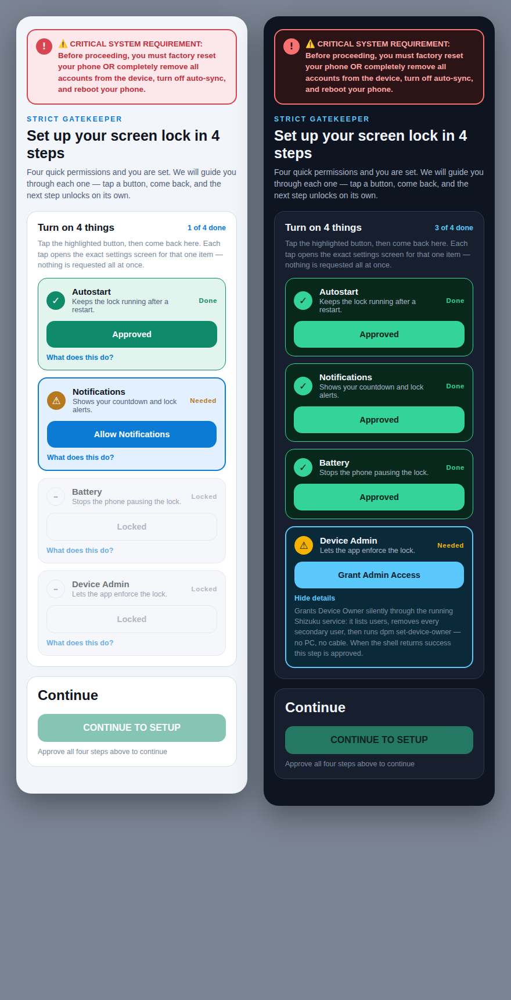
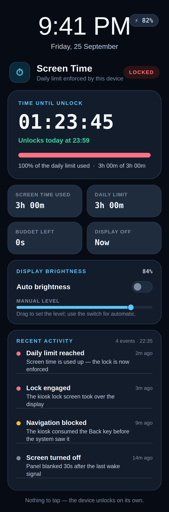

<div align="center">

# Screen Time Locker

### A screen-time lock that doesn't negotiate.

**Hard-enforced. Reboot-proof. Permanent by design.**

[](#build-from-source)
[-3DDC84?style=flat-square&logo=android&logoColor=white)](#requirements)
[](LICENSE)
[-orange?style=flat-square)](#build-from-source)
[](#release-signing)
[](../../releases)

</div>

Screen Time Locker counts the time your screen is actually on. Once you spend your daily allowance, it takes the phone over with a real system lock that survives reboots, force-stops and the person holding it. That person is you.

There is no *unlock anyway* button, no reset code and no PIN. You decide the rule once, on purpose, and Android enforces it after that.

It works by becoming your phone's **Device Owner** — the same role a company IT department uses on the phones it manages.

## Screenshots

<p align="center">
  
  
</p>

## Why it's different

Most screen-time tools are soft. They warn you, dim the screen, count your minutes, then step aside the moment you ask for five more. That comfort is exactly why they fail.

|  | Typical screen-time app | Screen Time Locker |
|---|---|---|
| Enforcement | Reminder banner | Device-Owner kiosk lock |
| Removable | Any time from Settings | No — settings are sealed once set up |
| After a reboot | Often resets | Re-arms before you even unlock |
| Unlock early | One tap | Not possible — no PIN, no release code |
| Your role | Player and referee | You set the rule; the system referees |

## How it works

1. You pick a limit — for example, two hours of screen-on time a day, resetting at 5 a.m.
2. Time is counted **only while the screen is on**. A phone in your pocket costs nothing.
3. When the budget runs out, a full-screen lock takes over. Back, Home and Recents stop working, and notifications and the status bar are disabled.
4. At the next window it unlocks on its own. No action needed.
5. Reboots don't help. A direct-boot receiver re-arms the guard before you type your passcode, so there is no gap to slip through.

The only way in is to wait for the window to end.

## Features

- **Real Device-Owner enforcement.** A lock-task kiosk through `DevicePolicyManager`, not an overlay you can swipe away.
- **Reboot-proof.** Direct-boot aware; re-arms pre-unlock with no OEM autostart permission needed.
- **Biometric-only admin door.** The console opens with `*#*#84635#*#*` plus a fingerprint. Nothing is stored, so there is nothing to steal.
- **Sealed after setup.** Once confirmed, the settings lock themselves and the app hides from your launcher.
- **Zero-cost idle.** No wake locks and no polling. Timers are passive alarms plus the platform's `JobScheduler`.
- **Quiet when locked.** The moment the lock engages, background apps are stopped and mobile data and Wi-Fi are switched off; on unlock every radio is restored exactly as it was. A locked phone becomes a quiet phone.
- **Live status-bar countdown.** Seconds remaining, drawn natively by SystemUI.
- **On-screen brightness control.** The lock screen sets the panel level and adaptive-brightness mode from a slider and switch — device-wide, with no extra permission.
- **Per-weekday limits.** Give each day its own budget, or switch a day off.
- **Optional hardening.** Block Safe Mode, block factory reset, disable USB debugging and freeze granted permissions. All off by default.
- **Light and dark themes** from a single design-token layer.
- **No Gradle.** Builds with the raw SDK command-line tools into one signed APK.

## Requirements

- Android 8.0 (API 26) or newer.
- A device prepared for Device Owner: factory reset it, or remove all accounts, turn off auto-sync and reboot.
- [Shizuku](https://shizuku.rikka.app/) is optional. It lets the app claim Device Owner without a PC, and it powers the optional shell-level hardening. Without it, use the one `adb` command the app shows you.
- A fingerprint enrolled, for the admin console.

Read the in-app warning before you start. Device Owner is a system-level change, and the app will not let you continue until you have acknowledged it.

## Install

1. Download the latest `timelock-locker.apk` from [Releases](../../releases).
2. Allow your browser or file manager to install unknown apps.
3. Open the APK and install it.
4. Launch the app and finish the four-step gatekeeper: autostart, notifications, battery, Device Admin.
5. Set your daily limit, reset time and warning seconds, then confirm.

The release APK is signed with the maintainer's private release key. See [Release signing](#release-signing) below, or build your own copy from source and sign it with a key you control.

## Build from source

You need a JDK, Kotlin and the Android SDK command-line tools (`aapt2`, `d8`, `zipalign`, `apksigner`). No Android Studio, no Gradle.

```bash
git clone https://github.com/emirofcordoba/screentime-locker.git
cd screentime-locker
bash build.sh
```

The script finds your SDK, compiles resources, Java and Kotlin, dexes everything including the bundled Shizuku client, then aligns and signs. The result lands in `build/timelock-locker.apk`.

| Variable | Meaning |
|---|---|
| `ANDROID_SDK_ROOT` | Where your Android SDK lives |
| `BUILD_TOOLS` | Force a build-tools version, e.g. `36.0.0` |
| `KOTLIN_STDLIB` | Path to `kotlin-stdlib.jar` |
| `SIGNING_STORE`, `SIGNING_PASS`, `SIGNING_ALIAS` | Sign with your own keystore |
| `OUT_NAME` | Rename the output APK |

Sign with your own key:

```bash
SIGNING_STORE=$HOME/keys/my-release.jks \
SIGNING_PASS='your-password' \
SIGNING_ALIAS=mykey \
bash build.sh
```

Then install it with `adb install -r build/timelock-locker.apk`.

## Project layout

```
screentime-locker/
├── AndroidManifest.xml    components, permissions, receivers, services
├── build.sh               one-command build, no Gradle
├── java/                  the engine and every screen
├── kotlin/                Kotlin tree (onboarding, Shizuku shell, admin section)
├── res/                   strings, colours, styles, layouts, drawables
├── libs/                  bundled Shizuku 13.1.5 client and provider jars
├── keystore/              the public test key
├── docs/                  deep-dive documentation
├── preview/               HTML and PNG design previews
└── assets/                images used here
```

[docs/ARCHITECTURE.md](docs/ARCHITECTURE.md) has the module map, and [docs/HOW-IT-WORKS.md](docs/HOW-IT-WORKS.md) explains the engine for people new to Android.

## Release signing

The binaries attached to [Releases](../../releases) are signed with the maintainer's own **private release key**, not the bundled test key. That keystore is kept offline and is never committed to this repository; only its public certificate identity is published:

- Subject: `CN=Sentinel TimeLock, OU=Mobile Security, O=Sentinel, L=NA, ST=NA, C=US`
- SHA-256: `75:EE:1E:4A:A7:3F:C4:23:CB:93:62:86:74:20:FE:DB:2B:90:2B:7E:C6:08:A2:B9:39:C0:4A:48:48:40:A4:AD`

Because Releases are signed with that key, only the holder of the private keystore can publish an update that Android accepts over an installed release build. Verify any download with:

```bash
apksigner verify --print-certs timelock-locker.apk
```

## The test signing key

The repo ships a throwaway key at `keystore/timelock-test.jks` (password `testkey123`, alias `timelock-test`). It exists so a fresh clone builds an installable APK with no setup.

Do not ship with it. The key is public, so anything signed with it can be impersonated — the certificate itself says `CN=Screen Time Locker TEST KEY (DO NOT SHIP)`.

For a real release, make your own key and keep it offline:

```bash
keytool -genkeypair -keystore my-release.jks -alias mykey \
  -keyalg RSA -keysize 4096 -validity 10950 -storetype PKCS12
```

Losing a signing key means you can never publish an update that Android accepts over an installed copy.

## Honest limits

The build compiles cleanly and produces a v2- and v3-signed APK, checked with `apksigner verify`. The enforcement logic is verified by static inspection of the compiled dex and packaged manifest. It has not been exhaustively tested on a live physical device, and Device-Owner behaviour varies by manufacturer. Test on a spare device before you rely on it.

Found something wrong? See [SECURITY.md](SECURITY.md) and [docs/TROUBLESHOOTING.md](docs/TROUBLESHOOTING.md).

## FAQ

**Do I need root?** No. It uses Android's own Device-Owner mechanism.

**Can I skip the factory reset?** Not for Device Owner. Android needs a device with no accounts. Removing every account and rebooting works too.

**What if I need the phone in an emergency?** Then don't install this on your only phone on day one. The app is non-bypassable on purpose, so test it on a secondary device first.

**Where is the unlock-anyway button?** There isn't one. That is the whole design. See [docs/PHILOSOPHY.md](docs/PHILOSOPHY.md).

**How do I remove it?** One route only: a factory reset — and only if you left the optional *Block factory reset* toggle off. There is no uninstall, no `adb` command and no in-app release once the app is Device Owner. If you turned the blocker on, the device must be re-flashed. Details in [docs/INSTALLATION.md](docs/INSTALLATION.md).

**The counter looks wrong.** Time only accrues while the screen is on, inside your window.

More questions are answered in [docs/FAQ.md](docs/FAQ.md).

## Contributing and license

Issues and pull requests are welcome. Read [CONTRIBUTING.md](CONTRIBUTING.md) first and keep the core promise intact. Released under the [MIT License](LICENSE). The bundled Shizuku jars are © RikkaApps under Apache 2.0 — see [libs/](libs/).

<div align="center">

**Set it once. Mean it. Then let the machine hold you to it.**

</div>
